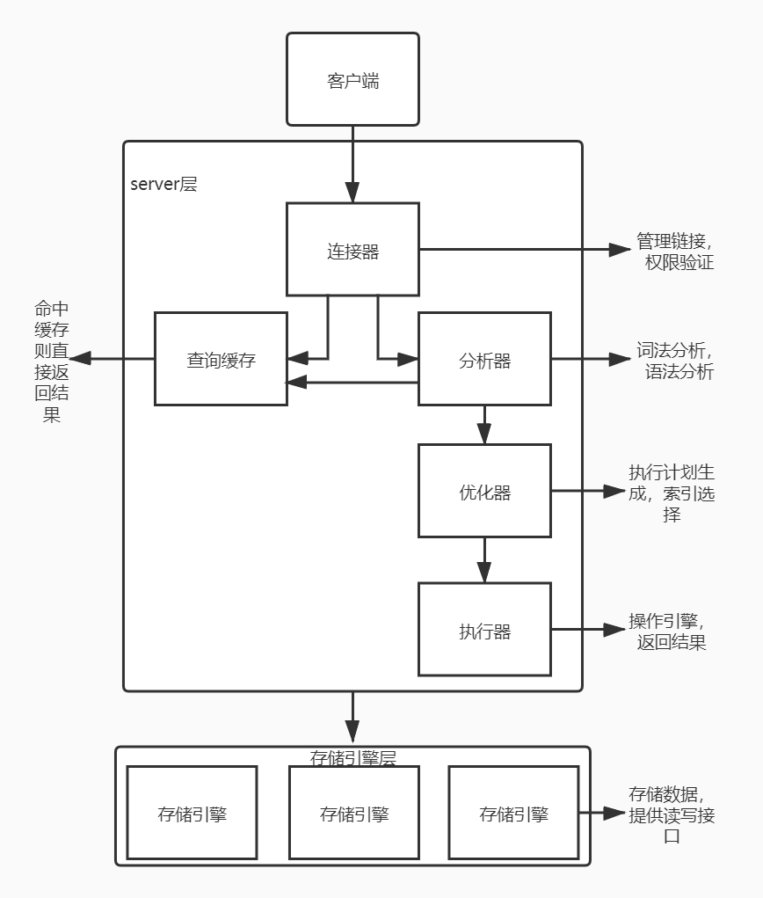
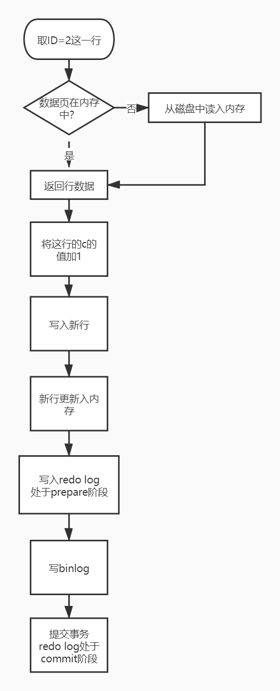

#  02 | 日志系统：SQL更新语句的执行

```sql
update T set c=c+1 where ID=2;
```

更新的SQL语句会把查询语句的流程同样走一遍。



执行语句前先要用连接器连接数据库。分析器会通过词法、语法解析知道这是一条更新语句。因为这是一个更新语句，所以会把这个表T上的所有缓存结果都i清空。优化器决定要使用ID这个索引。最后，执行器负责具体执行，找到这一行然后更新。

更新流程涉及两个重要的日志模块：redo log（重做日志）和binlog（归档日志）。

## 重要的日志模块：redo log

如果每一次的更新操作都需要写进磁盘，然后磁盘也要找到对应的记录/然后再更新，整个过程的IO成本、查找成本都很高。所以MySQL的的设计者用了WAL（Write-Ahead Logging)技术来提升更新效率。关键点是先写日志，再在不忙的时候写入磁盘。

当有一条记录需要更新的时候，InnoDB引擎会先把记录写到redo log里面，并更新内存，更新就算完成了。同时，InnoDB引擎会在适当的时候，将这个操作记录更新到磁盘里面。更新往往是在系统比较空闲的时候做。

InnoDB的redo log是固定大小的。

write pos是当前记录的位置，一边写一边后移，循环写如。checkpoint是当前要擦除的位置，也是往后推移并且循环的，擦除记录前要把记录更新到数据文件。

write pos和checkpoint之间空着的部分可以用来记录新的操作。如果write pos追上checkpoint，代表redo log写满了，这时候不能再执行新的更新，得先擦除掉一些记录推进checkpoint。

**有了redo log，InnoDB就可以保证即使数据库发生异常重启，之前提交的记录都不会丢失。这个能力称为crash-safe。**

## 重要的日志模块：binlog

上面的redo log是InnoDB引擎特有的日志。而MySQL的Server层也有自己的日志，称为binlog（归档日志）。

###### binlog和redo log这两种日志有以下三点不同：

1. redo log是InnoDB引擎特有的。binlog是MySQL的Server层实现的，所有引擎都可以使用。

2. redo log是物理日志，记录的是“再某个数据页上做了什么修改”。binlog是逻辑日志，记录的是这个语句的原始逻辑，如“给ID=2这一行的c字段加1”。

3. redo log是循环写的，空间固定会用完。binlog是可以追加写入的。binlog文件写到一定大小后会切换到下一个，并不会覆盖以前的日志。

   



以上是一条更新语句的流程图。流程如下。

1. 执行器先找引擎取ID=2这一行。因为ID是主键，引擎直接用树搜索找到这一行。如果ID=2这一行的数据页本来就在内存中，就直接返回给执行器；否则，需要先从磁盘读入内存，再返回。

2. 执行器拿到引擎给的行数据，把c值加1，得到一行新数据，再调用引擎接口写入这行新数据。

3. 引擎将这行新数据更新到内存中，同时将这个更新操作记录到redo log里面。此时redo log处于prepare状态。然后告知执行器执行完成了，随时可以提交事务。

4. 执行器生成这个操作的binlog，并把binlog写入磁盘。

5. 执行器调用引擎的提交事务接口，引擎把刚刚写入的redo log改成commit状态，更新完成。

   ***将redo log的写入拆成了两个步骤：prepare和commit，这就是“两阶段提交”。***

### 两阶段提交

两阶段提交是为了让两份日志之间的逻辑一致。

现在一般如果发生数据库误删的情况，可以通过数据库备份+binlog进行数据恢复。

如果不是两阶段提交，而是各自独立的写日志的话，假如数据库系统在写完第一个日志后，写第二个日志前发生了crash，就会发生恢复出来的数据库数据与原库不一致的情况。

不只是误操作删库后需要用binlog来恢复数据，当需要扩容的时候（也就是多搭建一些备库来增加系统的读能力的时候）也是用全量备份+binlog实现的。如果没有二阶段提交，可能会导致线上出现主从数据库不一致的情况。

**总结：** redo log和binlog都可以表示事务的提交状态，而两阶段提交就是让这两个状态保持逻辑上的一致。

------

扩展设置：

innodb_flush_log_at_trx_commit这个参数设置成1 的时候，表示每次事务的redo log都直接持久化到磁盘。

sync_binlog这个参数设置成1 的时候，表示每次事务的binlog都直接持久化到磁盘。

这两个参数都建议设置成1。

------

拓展：

redo log记录的是这个页做了什么改动。

binlog有两种模式，statement格式记录的是sql语句，row格式会记录行的内容，记两条，更新前和更新后都有。