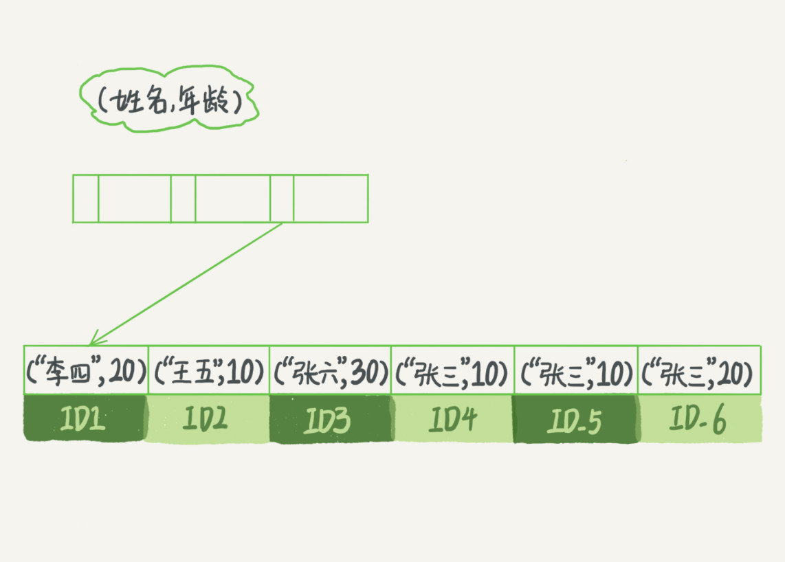

# 04 | 索引

索引的出现时为了提高数据查询的效率，就像书的目录一样。

## 索引的常见模型

1. ##### **哈希表**

   哈希表是一种以key-value储存数据的结构。哈希的思路很简单，把值放在数组里，用一个哈希函数把key换算成一个确定的位置。任何把value放在数组的这个位置。多个key值经过哈希函数的换算，会出现同一个值的情况。处理这种情况的一种方法是：拉出一个链表。

   优点：增加数据时速度很快，只需要往后追加。

   缺点：不是有序的，所以做区间查询的速度很慢。

   **哈希表结构只适用于有等值查询的场景。**

2. ##### **有序数组**

   按照查询字段递增等有顺序地排列成地数组，查询时用二分法就可以快速得到。

   优点：在等值查询和范围查询的场景中新能都非常优秀。

   缺点：在需要在中间插入数据时必须得挪动后面所有记录，成本太高。

   **有序数组索引只适用于静态存储引擎。**

3. ##### **搜索树**

   二叉搜索树的特点是：父节点左子树地所有节点小于父节点地值，右子树所有节点地值大于父节点的值。树可以有二叉也可以有多叉，子叉之间的大小保证从左到右递增。因为索引不止存在内存中，还要写到磁盘上。为了让一个查询尽量少读磁盘，就要使用“N叉”树。N叉树由于在读写上的性能优点，以及适配磁盘的访问模式，以及被广泛应用在数据库引擎中了。

数据库底层存储的核心是基于这些数据模型的。每碰到一个新数据库，我们需要先关注它的数据模型，这样才能从理论上分析出这个数据库的适用场景。

## InnoDB的索引模型

在InnoDB中，表都是根据主键顺序以索引的形式存放的，这种存储方式的表成为索引组织表。InnoDB使用了B+树索引模型，所以数据都是存储在B+树中的。每一个索引在InnoDB里面对应一棵B+树。B+树能够很好地配合磁盘地读写特性，减少单次查询地磁盘访问次数。

根据B+树叶子节点的内容，索引类型分为主键索引和非主键索引。

主键索引的叶子节点存的是整行数据。在InnoDB里，主键索引也被成为聚簇索引。

非主键索引的叶子节点内容是主键的值。在InnoDB里，非主键索引也被成为二级索引。

**基于主键索引和普通索引的查询的区别是：**

- 如果查询语句是主键查询方式，则指需要搜索ID这棵B+树。
- 如果查询语句是通过普通索引查询的，则需要先搜索那颗普通的索引树，得到索引对应的主键的值，在到主键索引树搜索一次。这个过程被称为**回表**。

基于非主键索引的查询需要多扫描一棵索引树，因此，我们在应用中应该尽量使用主键查询。

## 索引维护

B+树为了维护索引有序性，在插入新值的时候需要做必要的维护。如果只在主键最后一条插入新的记录，则只需要插入即可；但是如果要在主键的中间插入新记录，则需要逻辑上挪动后面的数据，空出位置。一个树叶节点所在的数据页如果已经满了，根据B+树的算法，这时候需要申请一个新的数据页，然后挪动部分数据过去。*这个过程被成为页分裂。页分裂会影响数据库的性能，和数据页的利用率。有分裂就有合并。当相邻两个页由于删除了数据，利用率很低之后，会将数据页做合并。*

自增主键的插入数据模式符合递增插入的场景，每次插入一条新纪录，都是追加操作，都不涉及挪动其他记录，也不会触发叶子节点的分裂。而有业务逻辑的字段做主键，则往往不容易保证有序插入，这样写数据的成本相对较高。同时，主键长度越小，普通索引的叶子节点就越小，普通索引占用的空间也就越小。

从性能和存储空间方面考量，自增主键往往是更合理的选择。但是也是有场景是适合业务字段直接做主键的。在只有一个索引、且该索引是唯一索引的情况下，是可以用业务字段做主键的。（key: value场景）

## 覆盖索引

在一个ID为主键、k为索引的表中，如果执行“select ID from T where k between 3 and 5”这个查询语句，这时ID的值已经在k索引树上了，因此可以直接提供查询结果，不需要回表。也就是说这个查询里面索引k已经“覆盖”了我们的查询需求。我们称之为覆盖索引。

由于覆盖索引可以减少树的搜索次数，显著提升查询性能，所以使用覆盖索引是一个常用的性能优化手段。

假如有一个表，表中主键是ID，索引是k、（i，j ）。这时业务上有一个高频请求，需要根据k字段查询对应的i字段，那么这时就可以建立一个（k，i）的联合索引，它可以在这个高频请求上用到覆盖索引，不再需要回表查整行记录，减少语句的执行时间。

## 最左前缀原则

**B+树这种索引结构，可以利用索引的“最左前缀”，来定位记录。**

在上图这个（name，age）这个联合索引中，索引项是按照索引定义里面出现的字段顺序排序的。

当逻辑需求是查到所有名字是“张三”的人时，可以快速定位到ID4，然后向后遍历得到所有需要的结果。如果要查的是所有名字第一个字是“张”的人，“where name like '张%'”，这时也能够用上这个索引，查找到第一个符合条件的记录是1D3，然后向后遍历，直到不满足条件为止。

可以看到，不只是索引的全部定义，只要满足最左前缀，就可以利用索引来加速检索。这个最左前缀可以是联合索引的最左N个字段，也可以是字符串索引的最左M个字符。

因为可以支持最左前缀，所以当已经有了（a,b）这个联合索引后，一般就不需要单独在a上建立索引了。**如果通过调整顺序，可以少维护一个索引，那么这个顺序往往就是需要优先考虑采用的。**

如果既有（a，b）联合查询，又有基于a、b各自的查询，那么只有b的语句是无法使用（a，b）这个联合索引的。这时，**考虑的原则是空间**，可以把较小的那个字段建立一个单字段索引。

## 索引下推

索引下推优化，可以在索引遍历过程中，对索引中包含的字段先做判断，直接过滤掉不满足条件的记录，减少回表次数。

当有一个查询语句是“select * from tuser where name like '张%' and age=10 and ismale=1;”且有联合索引（name，age）时，InnoDB会在索引中取出“name like '张%'”的记录（最左前缀原则），并且在索引内部就判断了age是否等于10。对于不等于10的记录直接判断并跳过。这样可以减少回表次数。

